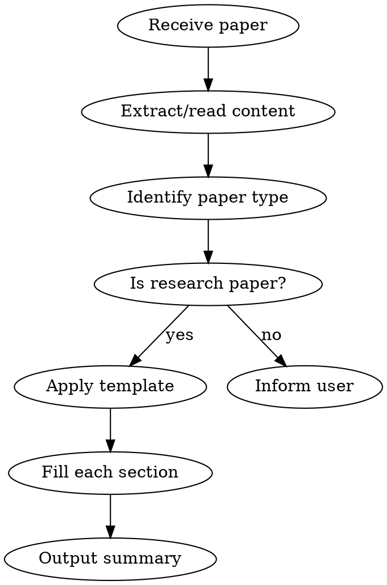

# Paper Reading - Research Paper Summarization

## Overview

A structured approach to reading and summarizing scientific research papers. Outputs a comprehensive summary in a standardized format covering research questions, methods, experiments, and key insights.

## When to Use

- User provides a paper (PDF path, URL, or pasted content) and asks for summary
- User asks to "read", "summarize", or "analyze" a research paper
- User wants to understand a paper's contribution quickly
- Literature review tasks

**Not for:** Tutorial papers, textbooks, or non-research documents

## Workflow



## Output Template

Use this exact format for all research paper summaries:

```markdown
## Basic Information
- **Title:**
- **Authors:**
- **Affiliation:** (optional)
- **Published:**
- **Link:**

## Research Problem
- **What problem does it solve?**
- **Mathematical formulation:** (optional)
- **Key assumptions:** What constraints/limitations frame the research
- **Why is it important?** (optional)

## Technical Method
### Overall Framework and Principles (if applicable)
- System architecture diagram
- How many neural networks, each one's input/output, purpose
- Signal update frequency

### Specific Algorithms (for each neural network)
- Network architecture (layers, construction), input/output
- Training objective and loss function
- How is training data obtained?
- Training algorithm insights and tricks

## Experimental Results
- **Experimental setup:** How was it constructed?
- **Baselines compared:**
- **Key results summary:** Where does it show clear advantages?

## Summary
- **Core idea:**
- **Main highlight:**
- **Future directions:**
- **Critiques:**
```

## Section Guidelines

### Basic Information
- Extract from paper header, abstract, or metadata
- For links: use DOI if available, otherwise arXiv or publisher URL

### Research Problem
- Focus on the GAP the paper addresses
- Mathematical description: include key equations if present
- Assumptions: what constraints or simplifications does the approach make?

### Technical Method
- **Architecture first:** Draw the big picture before diving into components
- **For each neural network:** Be specific about input dimensions, output dimensions, layer counts
- **Loss functions:** Write the actual equation if provided
- **Training data:** Note if synthetic, real-world, or mixed; mention dataset names

### Experimental Results
- Focus on quantitative improvements over baselines
- Note which metrics matter most for this problem domain
- Mention any surprising or counterintuitive results

### Summary
- **Core idea:** One sentence capturing the core contribution
- **Highlight:** What makes this paper stand out from prior work?
- **Extensions:** What would be natural next steps?
- **Critiques:** Limitations, missing comparisons, questionable assumptions

## Common Mistakes

| Mistake | Correction |
|---------|------------|
| Copying abstract verbatim | Synthesize in your own words |
| Missing key assumptions | Explicitly state what the method assumes |
| Vague architecture description | Include specific dimensions and layer types |
| Ignoring failure cases | Note where method underperforms |
| Skipping mathematical notation | Include key equations when available |

## Language

- Output summary in the user's preferred language
- Technical terms can remain in English (API, Loss, Baseline, etc.)
- Code and equations in original form
